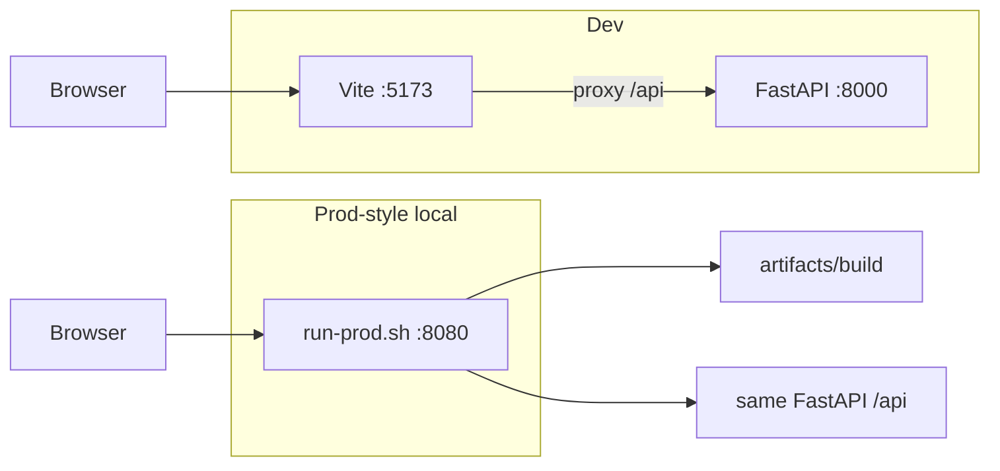

# Architecture

High-level layout of the World Cup 2026 predictive dashboard monorepo.

## Purpose

The app ranks national teams and estimates 2026 World Cup win (and stage-reach) probabilities. Team strength comes from trained **Elo** ratings or **FIFA**-based pseudo-Elo. A Monte Carlo simulator walks the 2026 bracket forward from a chosen stage cutoff. The dashboard pins that stage and shows predictions, groups, and knockout fixtures.

## Repo components

| Path | Role |
|------|------|
| [`model/`](../model/) | Data pipeline (fetch, process, train, simulate). Sources/artifacts in subfolders. |
| [`dashboard/backend/`](../dashboard/backend/) | FastAPI app exposing `/api/*`, loads models & runs simulations. |
| [`dashboard/frontend/`](../dashboard/frontend/) | React + Vite frontend (Predictions, Teams, Knockout views). |
| [`dashboard/artifacts/build/`](../dashboard/artifacts/build/) | Production static build output (gitignored). |

## Runtime modes

**Dev (local)** — Two processes: Vite on port **5173** (proxies `/api` to the backend) and FastAPI on **8000**. Use [`./start-dashboard-local.sh`](../start-dashboard-local.sh) from the repo root.

**Prod-style (local)** — Single process: [`run-prod.sh`](../dashboard/backend/run-prod.sh) runs uvicorn on `$PORT` (default **8080**). [`main.py`](../dashboard/backend/app/main.py) serves `/api/*`, static files, and SPA routes. Build frontend first (`dashboard/frontend/build.sh`). Same as production on Google Cloud Platform.

## Data and request flow

- **Warm start:** Committed Elo and prediction JSON under `model/artifacts/` let the UI load rankings without re-simulating. World Cup root raw JSON (`2018`/`2022`/`2026`) and `matches.parquet` are **not** in git; run `fetch_data.py` + `ingest.py`.
- **Rankings:** Cached from artifacts when available; live Monte Carlo via `POST /api/simulations` then poll `GET /api/simulations/{job_id}`.
- **Stage masking:** Groups and knockout pages hide future results in the browser; the API returns the full match/group dataset for the year.

## Deployment on Google Cloud Platform (GCP)

Target shape: **one container**, one Cloud Run service — FastAPI serves the built SPA and API on the same origin. The root [`Dockerfile`](../Dockerfile) installs Python deps, builds the frontend, and runs fetch + ingest so parquet exists at runtime. 

Local container build and smoke test are documented in: [docker-local.md](docker-local.md).

GCP setup and deployment are documented in: [gcp-setup.md](gcp-setup.md).

The public URL sits in front of that Cloud Run service via Firebase Hosting, which rewrites all requests to the container (the image itself is unchanged). Hosting setup and deploy are documented in: [firebase-hosting.md](firebase-hosting.md).

## Related docs

- [README](../README.md) — quick start, tournament model, UI, data sources
- [dev-setup.md](dev-setup.md) — local dev setup for model building and app/API development
- [docker-local.md](docker-local.md) — build and run Docker container locally
- [gcp-setup.md](gcp-setup.md) — Artifact Registry and Cloud Run
- [firebase-hosting.md](firebase-hosting.md) — public URL via Firebase Hosting
