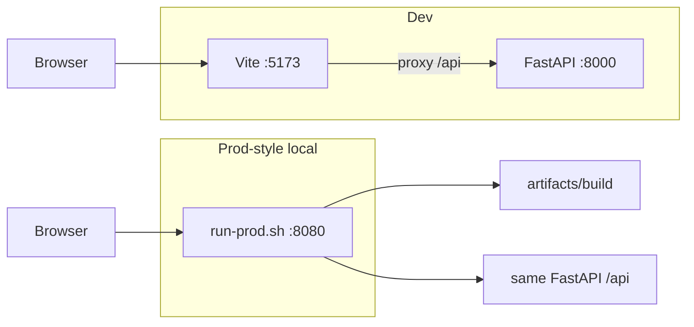

# Architecture

High-level layout of the World Cup 2026 predictive dashboard monorepo.

## Purpose

The app ranks national teams and estimates 2026 World Cup win (and stage-reach) probabilities. Team strength comes from trained **Elo** ratings or **FIFA**-based pseudo-Elo. A Monte Carlo simulator walks the **real** 2026 bracket forward from a chosen stage cutoff. The dashboard pins that stage and shows predictions, groups, and knockout fixtures.

## Repo components

| Path | Role |
|------|------|
| [`model/`](../model/) | Pipeline: fetch → ingest → train → simulate. Source under `model/src/`. Artifacts in `model/artifacts/`; raw and processed data in `model/data/`. |
| [`dashboard/backend/`](../dashboard/backend/) | FastAPI app. [`loader.py`](../dashboard/backend/app/services/loader.py) loads artifacts and imports `model/src`. [`routes.py`](../dashboard/backend/app/api/routes.py) exposes `/api/*`. Simulations run in background threads (in-memory job store). `POST /api/refresh-data` runs model scripts via subprocess. |
| [`dashboard/frontend/`](../dashboard/frontend/) | React + Vite. Relative `/api` calls in [`client.ts`](../dashboard/frontend/src/api/client.ts). Pages: Predictions (`/`), Teams & groups (`/teams`), Knockout (`/knockout`). |
| [`dashboard/artifacts/build/`](../dashboard/artifacts/build/) | Production static output from `npm run build` / `./build.sh` (gitignored). |

## Runtime modes

**Dev** — Two processes: Vite on port **5173** (proxies `/api` to the backend) and FastAPI on **8000**. Use [`./start-dashboard-local.sh`](../start-dashboard-local.sh) from the repo root, or `dashboard/backend/./run.sh` and `dashboard/frontend/./run.sh` separately.

**Prod-style (local / Cloud Run target)** — One process: [`run-prod.sh`](../dashboard/backend/run-prod.sh) runs uvicorn with `$PORT` (default **8080**). [`main.py`](../dashboard/backend/app/main.py) serves `/api/*`, static files under `/assets`, and SPA `index.html` for client routes (`/`, `/teams`, `/knockout`, …). Build the frontend first (`dashboard/frontend/./build.sh`).

## Data and request flow

- **Warm start:** Committed Elo and prediction JSON under `model/artifacts/` let the UI load rankings without re-simulating. World Cup root raw JSON (`2018`/`2022`/`2026`) and `matches.parquet` are **not** in git; run `fetch_data.py` + `ingest.py` (see [NOTICE](../NOTICE.md)).
- **Rankings:** Cached from artifacts when available; live Monte Carlo via `POST /api/simulations` then poll `GET /api/simulations/{job_id}`.
- **Stage masking:** Groups and knockout pages hide future results in the browser; the API returns the full match/group dataset for the year.
- **Refresh:** UI **Refresh data** (or CLI) re-fetches World Cup JSON, then ingest / train / simulate for every stage.

## Deployment on Google Cloud Platform (GCP)

Target shape: **one container**, one Cloud Run service — FastAPI serves the built SPA and API on the same origin. The root [`Dockerfile`](../Dockerfile) installs Python deps, builds the frontend, and runs fetch + ingest so parquet exists at runtime. 

Local container build and smoke test are documented in: [docker-local.md](docker-local.md).

GCP setup and final deployment are documented in: [gcp-setup.md](gcp-setup.md).

## Related docs

- [README](../README.md) — quick start, tournament model, UI, data sources
- [NOTICE](../NOTICE.md) — third-party data and what is committed
- [dev-setup.md](dev-setup.md) — local dev setup for app/API development
- [docker-local.md](docker-local.md) — build and run Docker container locally
- [gcp-setup.md](gcp-setup.md) — Artifact Registry and Cloud Run
