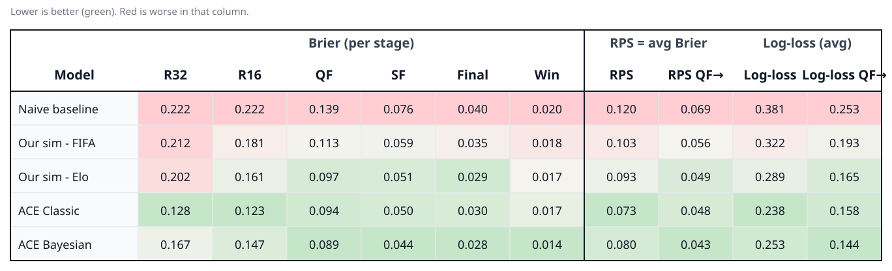
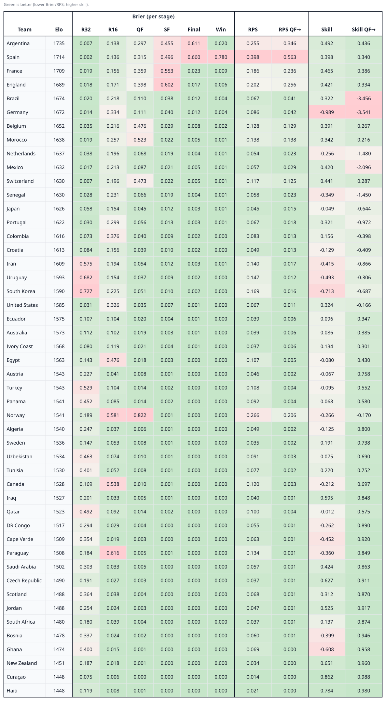

# Evaluation results

Scores for the 2026 World Cup forecasts in this repo. Metric definitions: [evaluation-metrics.md](evaluation-metrics.md). 

Match and simulation numbers come from committed `match_metrics.json` and `simulation_metrics.json`. ACE Laboratory rows are transcribed from [their 2026 model comparison](https://ac3lab.github.io/blog/2026/model_comparison_en/) (Figures 3–5). Regenerate with `python scripts/write_evaluation_md.py` from `model/`.

Lower Brier, RPS, and log-loss are better. Per-stage columns are Brier scores. RPS is the average of those Briers (R32 through champion), matching ACE’s tournament RPS; RPS QF→ averages QF through champion. Log-loss columns use the same averaging.

## All-match evaluation

Pre-tournament strength models scored on all World Cup matches (three-way win/draw/lose).

| Model | 2022 log-loss | 2022 Brier | 2026 log-loss | 2026 Brier |
| :--- | :---: | :---: | :---: | :---: |
| FIFA | 1.0194 | 0.2033 | 1.0046 | 0.1978 |
| Elo | 1.0211 | 0.2036 | 0.9562 | 0.1848 |

## Full tournament simulation results

Naive baseline is equal-share chance (each of the 48 teams has probability *k*/48 of occupying one of *k* remaining slots). Our sim rows use pre-tournament Monte Carlo results. Stage columns are Brier; RPS is average Brier. The color scale is column-wise (green = best / lowest among shown models).

## Per-team RPS (Our sim - Elo)

Pre-tournament Elo simulation scored per country. Stage columns are that team’s Brier for each reach event. RPS is the average of those Briers (R32 through champion); RPS QF→ averages QF through champion. RPS skill is `1 − team RPS / team equal-share RPS` (higher is better). Teams are ordered by Elo rank. Color scale is column-wise (green = best among the 48 teams).

