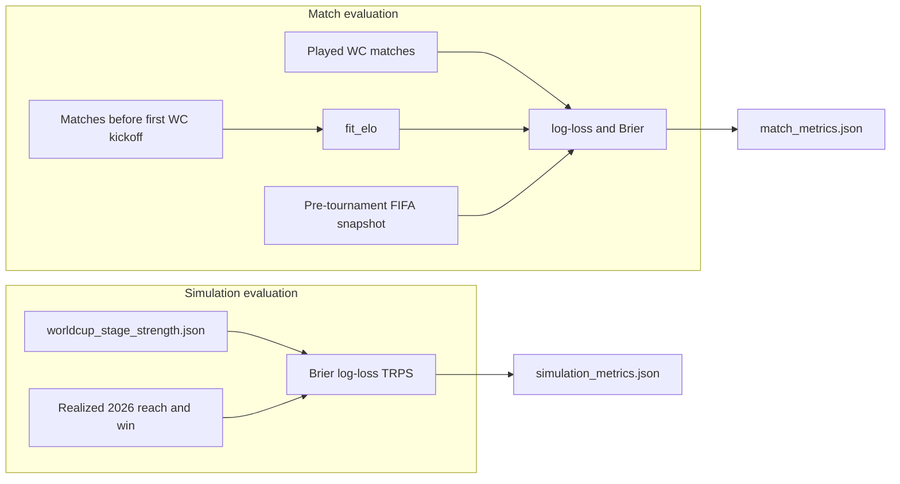

# Evaluation

Two separate evaluations measure this project’s forecasts. **Match evaluation** scores the strength model on individual World Cup games. **Simulation evaluation** scores the Monte Carlo tournament outputs (stage-reach and win probabilities) against the realized 2026 bracket.

They answer different questions. Match-level log-loss and Brier say whether Elo (or FIFA pseudo-Elo) assigned sensible win/draw/lose probabilities. They do not say whether the simulator’s `P(reach QF)` or `P(win)` were well calibrated. Published tournament-forecast systems (Groll/Zeileis, FiveThirtyEight SPI, Opta, ACE Lab’s 2026 comparison) report both kinds of scores.



Run both from `model/`:

```bash
python scripts/evaluate.py
```

`train.py` also reruns match evaluation after fitting Elo. `simulate.py` reruns simulation evaluation after writing prediction JSON. Neither evaluation uses the dashboard stage selector; they are batch backtests over committed data and artifacts.

## 1. Match evaluation

**Code:** [`model/src/evaluate_matches.py`](../model/src/evaluate_matches.py)  
**Output:** [`model/artifacts/evaluation/match_metrics.json`](../model/artifacts/evaluation/match_metrics.json)  
**Years:** 2022 and 2026 (`BACKTEST_YEARS` in [`model/src/config.py`](../model/src/config.py))  
**Strength sources:** trained Elo vs FIFA pseudo-Elo

This is a proper-score backtest of three-way match probabilities (team1 win / draw / team2 win). Lower log-loss and Brier are better.

### Training window (no leakage)

For each test year *Y*, Elo is fit only on **played** matches whose `date` is **strictly before** the first *Y* World Cup kickoff. The cutoff is `min(date)` of that year’s `world_cup` rows, not a hardcoded calendar date. With current data that is **2022-11-20** (Qatar) and **2026-06-11**.

That split excludes:

- every match in the test World Cup
- later same-year friendlies and other competitions
- later calendar years (so a 2022 backtest cannot see 2023–2026 results)

Rows with missing or unparseable dates are dropped from training. Elo initial ratings still come from the FIFA **tuning** snapshot (`2017-12`), which sits before the training window.

During the test tournament, ratings are **frozen**. Each WC match is scored with `EloModel.match_probs` from those pre-tournament ratings (or from FIFA pseudo-Elo). Outcomes use full-time goals only (0 = team1 win, 1 = draw, 2 = team2 win).

### FIFA snapshots

The FIFA comparison model must not use a ranking published after the tournament. [`model/data/fifa_rankings.json`](../model/data/fifa_rankings.json) maps years in `backtest_snapshots`:

| Test year | Snapshot | Meaning |
|-----------|----------|---------|
| 2022 | `2022-10` | Final pre-Qatar ranking |
| 2026 | `2026-04` | April 2026 ranking (before June kickoff) |

`display_snapshot` (`2026-04`) is what the dashboard shows for FIFA strength. It is **not** used for the 2022 FIFA backtest.

### Metrics

For each strength source and year:

- **Log-loss** — multiclass `sklearn.metrics.log_loss` over labels `{0, 1, 2}`
- **Brier** — mean of the three-way Brier score (one-hot outcome vs predicted probabilities)
- **n_matches** — 64 in 2022, 104 in 2026

`mean_log_loss` and `mean_brier` are **n_matches-weighted** averages across years.

```json
{
  "elo": {
    "years": {
      "2022": { "log_loss": 1.021, "brier": 0.204, "n_matches": 64 },
      "2026": { "log_loss": 0.956, "brier": 0.185, "n_matches": 104 }
    },
    "mean_log_loss": 0.981,
    "mean_brier": 0.192
  },
  "fifa": { }
}
```

`GET /api/metrics` returns this file. The frontend does not plot it yet.

## 2. Simulation evaluation

**Code:** [`model/src/evaluate_simulation.py`](../model/src/evaluate_simulation.py)  
**Output:** [`model/artifacts/evaluation/simulation_metrics.json`](../model/artifacts/evaluation/simulation_metrics.json)  
**Year:** 2026 only  
**Inputs:** committed [`model/artifacts/predictions/worldcup_{stage}_{strength}.json`](../model/artifacts/predictions/) files — the same forecasts the dashboard shows

This scores the **tournament simulator**, not the per-match engine. There is no 2022 tournament simulation (the 32-team bracket is a different format).

### What published systems score

1. **Binary proper scores per event** — treat each team’s `P(reach R16)`, `P(reach QF)`, …, `P(win)` as Bernoulli forecasts; report Brier (and often log-loss). FiveThirtyEight’s “checking our work” is this plus calibration and a **Brier skill score** vs a naive baseline.
2. **Ordinal rank probability score on exit stage** — “how far did this team go?” is ordered (group exit < R32 < R16 < QF < SF < runner-up < champion). Being off by one round costs less than being off by four (Constantinou & Fenton 2012).
3. **Tournament Rank Probability Score (TRPS)** (Ekstrøm et al., *Journal of Sports Analytics*, 2021) — the same idea as a matrix over *partial ranks*. Academic comparisons of one-shot pre-tournament forecasts (Groll et al., bookmaker models) use this.
4. **Forecast vintages** — after each round, re-simulate the remainder and score again (Zeileis/Groll post-group updates; 538 daily updates). If already-resolved events are included, later vintages look artificially perfect (those Briers go to 0). This project scores **only unresolved events** at each vintage for Brier/log-loss, and still reports full-ranking TRPS.

### Realized 2026 outcomes

From played 2026 `world_cup` knockout rows (`stage` in `r32, r16, qf, sf, final`): a team **reached** that round if it appears in a fixture. The champion is the `advancer` of the played final (same extra-time/penalty rule as ingest). Expected counts: 32 / 16 / 8 / 4 / 2 / 1.

### Vintages and unresolved events

Each prediction file already conditions on realized results through that cutoff (and uses the matching `elo_{stage}.json`). Locked rounds are omitted from Brier/log-loss:

| Vintage | Score these |
|---------|-------------|
| `pre_tournament` | r32, r16, qf, sf, final, win |
| `group` | r16, qf, sf, final, win |
| `r32` | qf, sf, final, win |
| `r16` | sf, final, win |
| `qf` | final, win |
| `sf` | win |

`complete` is skipped (everything is known).

### Metrics

**Per event (unresolved only), over all 48 teams:**

- Brier `(p - y)²`
- Binary log-loss, with `p` clipped to `[1e-15, 1-1e-15]`

**TRPS** converts the cumulatives to seven partial ranks (2026 slot sizes 1 / 1 / 2 / 4 / 8 / 16 / 16):

- `P(champion) = p_win`
- `P(runner-up) = p_final - p_win`
- `P(sf_exit) = p_sf - p_final`
- `P(qf_exit) = p_qf - p_sf`
- `P(r16_exit) = p_r16 - p_qf`
- `P(r32_exit) = p_r32 - p_r16`
- `P(group_exit) = 1 - p_r32`

Tiny negative diffs from Monte Carlo noise are clipped to 0 and the column is renormalized. TRPS is the mean over teams of the mean squared CDF error (Ekstrøm et al. eq. 2). Zero is perfect.

**Baseline and skill.** At that vintage, remaining teams share remaining slots equally (pre-tournament `p_win = 1/48`; after groups, the 32 survivors share `p_r16 = 16/32`, and so on). Eliminated teams have baseline 0. `brier_skill = 1 - mean_brier / mean_brier_baseline` on the unresolved-event mean. Positive skill means the forecast beat equal-share chance.

The JSON is self-describing for a later dashboard: `year`, ordered `events` and `stages` (ids, labels, `unresolved_events`), then `strengths` → stage with aggregates **and** per-team `p_*` / `y_*` rows (locked rounds omitted). No API route or UI chart exists yet; a future `GET /api/simulation-metrics` can return this file as-is.

## What is not evaluated

- 2022 full-tournament simulation
- Weighted TRPS variants (equal rank weights only)
- Calibration plots
- Re-running Monte Carlo inside evaluate (simulation scoring uses the committed prediction artifacts)

## See also

- [dev-setup.md](dev-setup.md) — how to run the pipeline
- [architecture.md](architecture.md) — artifacts and data flow
- [README](../README.md) — tournament model and stage selector
