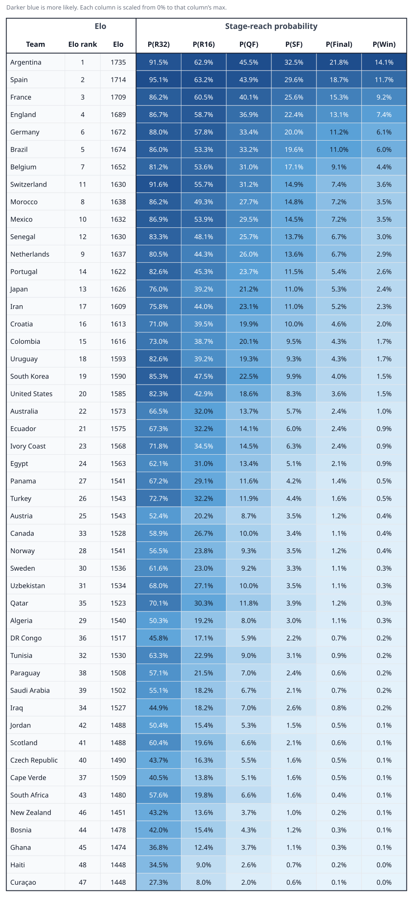

# Pre-tournament predictions

Monte Carlo stage-reach and win probabilities **before any 2026 match**, from the Elo strength model.

The live dashboard also has these numbers (plus FIFA rankings) at: [https://worldcup2026-dashboard.web.app/](https://worldcup2026-dashboard.web.app/).

Generated from committed `worldcup_pre_tournament_elo.json` (10,000 runs). Regenerate with `python scripts/write_predictions_md.py` from `model/`.

